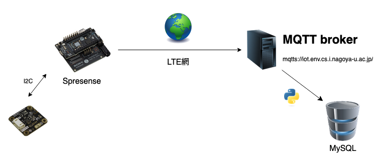

### 環境データ計測デバイス

SpresenseとLTE拡張ボード、DFRobot 多機能環境センサで作る環境データ計測デバイスのソースコードです。

- センサで環境データを計測しLTEネットワークを介してMQTTブローカに転送
- GPSの情報とバッテリー電圧も転送（移動型データロガーとして運用可能）

計測データ: [https://iot.env.cs.i.nagoya-u.ac.jp/view_data/sen0501/](https://iot.env.cs.i.nagoya-u.ac.jp/view_data/sen0501/)
